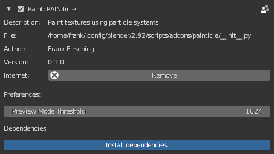

# Installation

To install the add-on grab a release from GitHub's [releases](https://github.com/FrankFirsching/PAINTicle/releases)
page. The downloaded zip file can be installed via `Edit > Preferences > Add-ons > Install...`

This add-on makes use of the python module [moderngl](https://github.com/moderngl/moderngl) under the MIT license.
This module should be installed automatically when activating the add-on. The preferences panel shows a successful
installation by showing a blue/checked button "Install dependencies". If the dependencies are not available, this
button will be clickable gray and it can trigger the installation of the dependencies.

## Requirements

The add-on requires a GPU capable of OpenGL 4.3, which provides support for compute shaders. This is a higher level
than Blender requires. It might be, that your system can run Blender, but it can't support this add-on. Please advice
Blenders system information `Help > Save System Info` if your system supports at least the required version.
