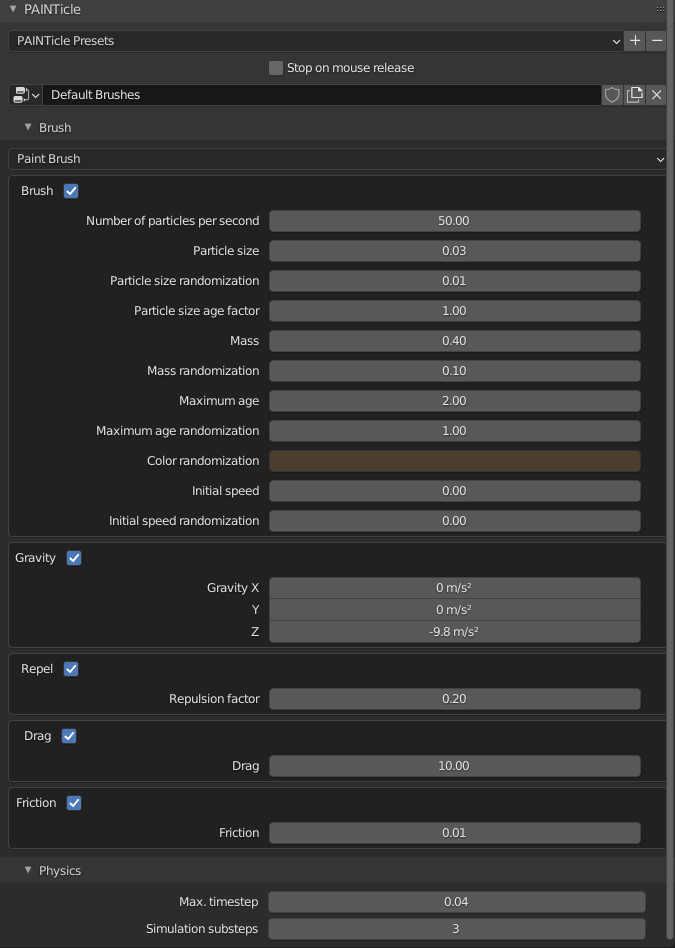
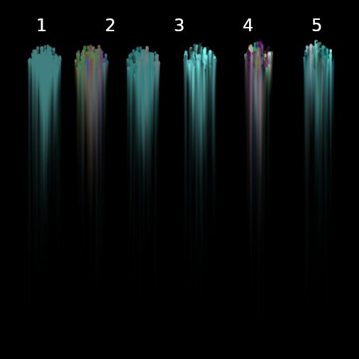

# PAINTicle - Usage

To activate the particle brush, enter texture paint mode as usual. Then run the add-on's operator
`PAINTicle` by clicking on the menu button in the 3d-view's top menu bar.

This will activate the add-on on the object currently been drawn on. By drawing onto the mesh,
Blender is not using the normal brush anymore but simulates particles' movement over the surface
of the selected mesh. Leaving the particle paint mode can be done by hitting `ESC`.

 The *Tools* panel offers a group with settings for the particle brush:

 

| Property                            | Description                                                                                                                                               |
| ----------------------------------- | --------------------------------------------------------------------------------------------------------------------------------------------------------- |
| Number of particles per second      | This is the flow rate of the particle simulation                                                                                                          |
| Particle size                       | The size of a single particle in pixels of the texture                                                                                                    |
| Particle size randomization         | The deviation range for random particle sizes. Concrete particle size enlarge or shrink by given pixel size the above specified average particle size. |
| Particle size age factor            | A multiplicative factor depending on the age of the particle. Values  <1 let the particle shrink over time.  >1 make it grow.                       |
| Mass                                | The mass of a particle.                                                                                                                                   |
| Mass randomization                  | The deviation range of the particle's mass.                                                                                                               |
| Maximum age                         | The average age of a particle. When a particle reaches maximum age, it dies.                                                                              |
| Maximum age randomization           | The deviation range for the lifetime of a particle.                                                                                                       |
| Color randomization                 | Deviation ranges for the colorization of the particle. See [Colorization](#Colorization)                                                                  |
| Stop on mouse release               | Will stop the simulation as soon as the mouse button has been released. Otherwise simulation continues until all particles died.                          |
| Physics                             |                                                                                                                                                           |
| Physics/Gravity X,Y,Z               | The gravity force applied to all particles-                                                                                                               |
| Physics/Initial speed               | The initial speed, when emitting particles. Particles move in view direction.                                                                             |
| Physics/Initial speed randomization | Deviation factor for the initial speed added in all directions (x,y,z) to the initial speed vector.                                                       |
| Physics/Friction                    | The particles friction when sliding over the painted surface.                                                                                             |
| Physics/Max. timestep               | A maximum time-step for the simulation. Choose as low, so that particles don't leave dotted traced.                                                        |

## Other properties used

The particle brush utilizes the following common brush properties of Blender's built-in painting system
 
 * Radius   (`F` or `right-click`)
 * Strength (`SHIFT+F` or `right-click`)
 * Color    (`right-click`)

## Colorization

PAINTicle uses a HSV base randomization scheme to define color variation for the particles. The property
*Color randomization* specifies in HSV space, the possible ranges how the real particle color can deviate from
the brush's color.

The following image shows possible influences of the color variation to the result. The brush color was chosen as HSV(0.5,0.5,0.5).

From left to right these *Color randomization* parameters were used:

|     1      |      2       |      3       |      4       |        5         |        6         |
| :--------: | :----------: | :----------: | :----------: | :--------------: | :--------------: |
| HSV(0,0,0) | HSV(0.5,0,0) | HSV(0,0.5,0) | HSV(0,0,0.5) | HSV(0.5,0.5,0.5) | HSV(0.1,0.5,0.5) |

The hue randomization has a quite drastic effect, so you might want to choose very small values for
this. It can be seen quite well in example 4, where the drawn effect has very little color
correspondence to the chosen brush color. Setting it down to 0.1 as in example 5, the result
is a much nicer color variation still in the overall color range of the chosen brush color.

Please note: Blender doesn't store the hue value in case saturation or value are 0. So case 2 was utilizing
saturation and value of 0.001 as an approximation to 0.

## Undo

Currently there's an issue in Blender when undoing pixel manipulations on image textures. Thus the add-on
implements it's own single step undo queue. While painting, you can press `U` to undo the last paint operation.